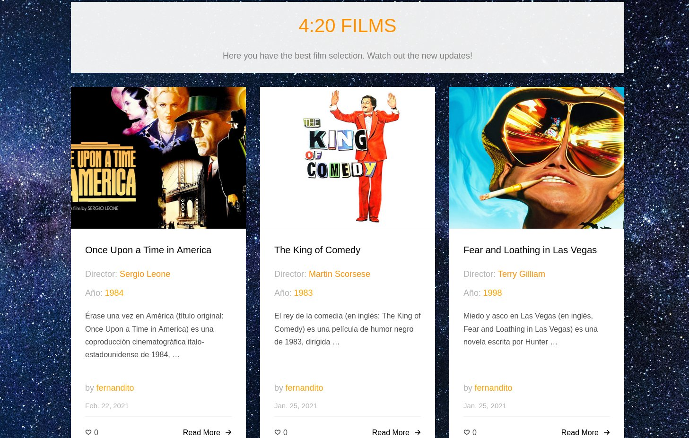
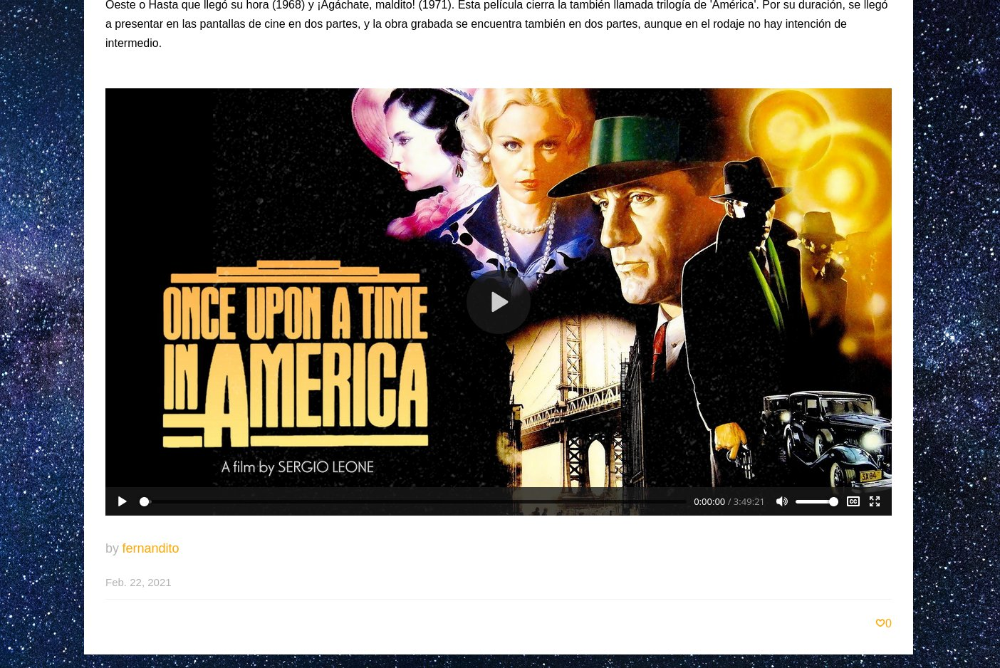
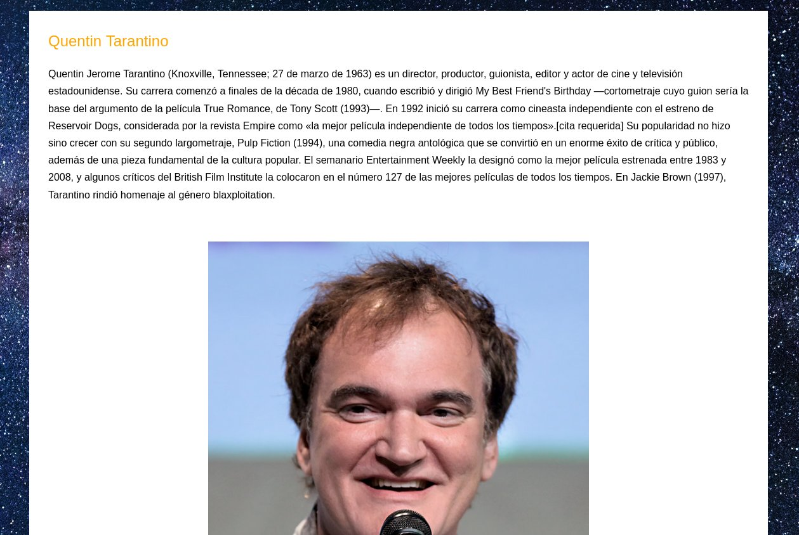

# 4-20-FIlms
**4:20 Films** is a web-server for film streaming. Films can be either watch online or download via web-page. Developed with ***Django***. For production use, I used ***Nginx-Gunicorn-Django*** combination.

*this repository only include the ***Django*** proyect. ***Nginx*** and ***Gunicorn*** configuration files and sockets are **not included**. Film files are also not included ;)

## Structure
* **appMediaCenter**: sql querys to construct the database of the web page in mysql.
  * **migrations**:
  * **static**:
    * **admin**:
    * **css**:
    * **fonts**:
    * **js**:
    * **media**:
  * **templates**:
    * **base.html**:
    * **director.html**:
    * **film.html**:
    * **index.html**:
  * **admin.py**:
  * **apps.py**:
  * **models.py**:
  * **urls.py**:
  * **views.py**:
* **MediaCenter**:
  * **settings.py**:
  * **urls.py**:
  * **wsgi.py**:
* **db.sqlite3**:
* **manage.py**:
